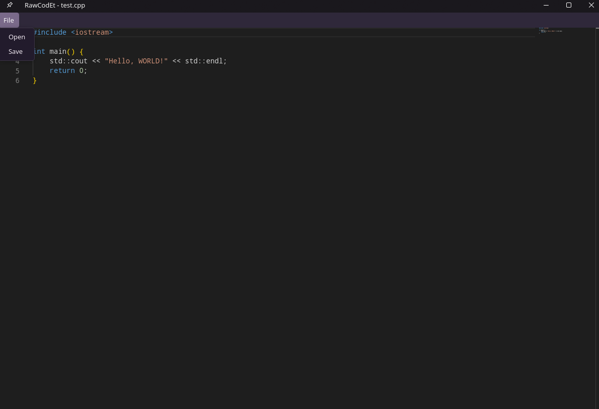
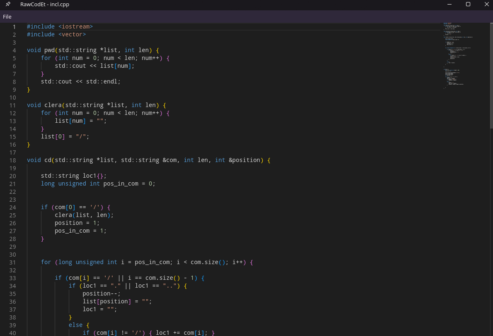

# RawCodEt
A modern cross-platform code editor built with C++20 and Qt6, featuring remote code execution and PostgreSQL-based project synchronization.

# Процесс работы
На данный момент реализован клиент, который работает с движком monaco-editor (используется компанией Microsoft в VS code и является open source проектом). 

**Предстоит сделать выбор между тем**, чтобы каждый раз подтягивать движок скриптом с CDN, или же поставлять локально вместе со всй сборкой, что работает быстрее, но несет нагрузку на память.

## Пример UI

